## **Шаг 1. Создание программы**

В своем подразделении создайте новую образовательную программу БАС.

Для этого нажмите кнопку **«Добавить»** и заполните карточку программы.

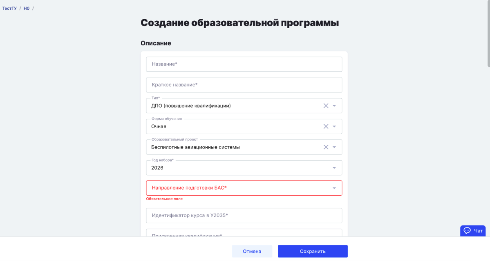{width=1199px height=640px}

Обязательно укажите следующие поля:

-  Наименование программы.

-  Краткое название программы.

-  Тип программы.

-  Формат обучения.

-  Образовательный проект -- **БАС**.

-  Направление подготовки (ранее -- трек). Необходимо указать направление, которое направлялось в Университет 2035.

-  Идентификатор курса на платформе Университета 2035.

-  Присвоенную квалификацию. Если нет, напишите “без присвоения квалификации”

Поле **«Тег знаний»** заполнять не нужно.

Если программа реализуется в дистанционном формате, установите соответствующий чек-бокс.

Также заполните:

-  аннотацию программы;

-  описание программы;

-  трудоемкость;

-  количество зачетных единиц.

Настройте права доступа и укажите ответственного за программу.

Важно: у методиста, назначаемого ответственным, должен быть создан аккаунт У2035 и присвоен UNTI ID.

После создания программы можно переходить к созданию потока.

Поток -- это группа обучающихся, которая проходит обучение по одной образовательной программе в определенный период времени.

## **Шаг 2. Создание потока**

На странице программы нажмите кнопку **«Добавить»**. Откроется форма создания потока.

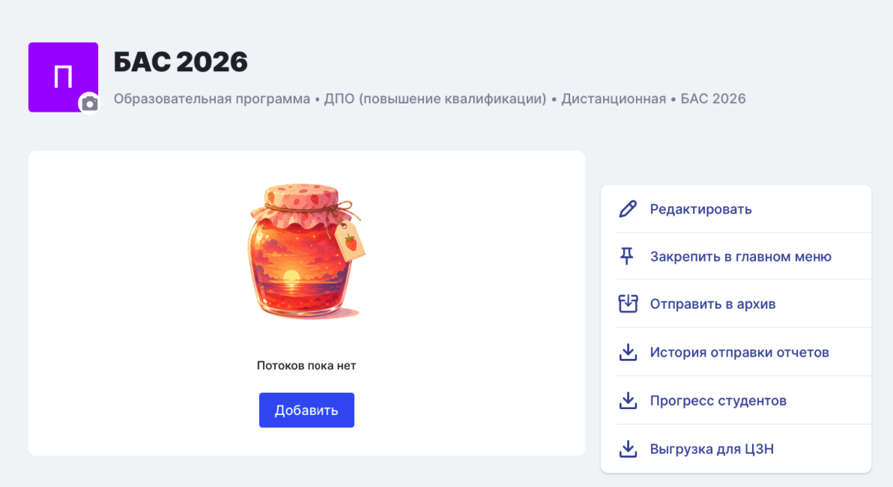{width=1192px height=650px}

Заполните основные параметры:

-  название потока;

-  даты начала и окончания обучения;

-  идентификатор потока в Университете 2035.

При необходимости настройте дополнительные параметры:

-  доступность дисциплин только после прохождения предыдущих;

-  необходимость предоставления подтверждающих документов по итогам аттестации.

Отметку «Регистрация на обучение по ссылке» рекомендуем не устанавливать.

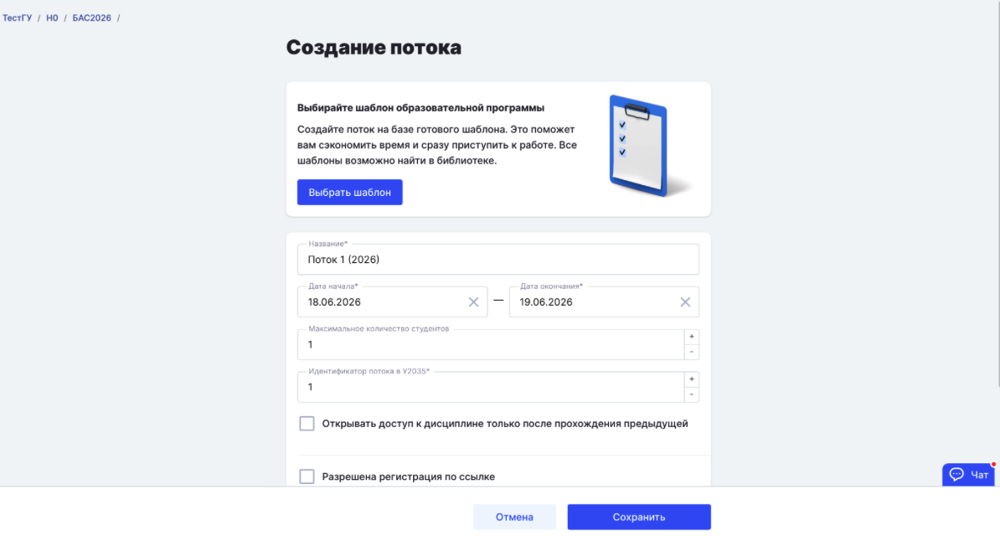{width=1194px height=640px}

После заполнения всех необходимых полей сохраните поток.

Обратите внимание: на текущем этапе создавать шаблон потока не требуется. Заполняемых полей не так много, а большинство из них являются уникальными для каждого потока.

## **Шаг 3. Создайте дисциплины (блоки)**

На этом этапе необходимо создать основные блоки программы:

-  теоретический блок;

-  практический блок;

-  блок итоговой аттестации.

Для создания блока нажмите **«Добавить»** и заполните необходимые поля.

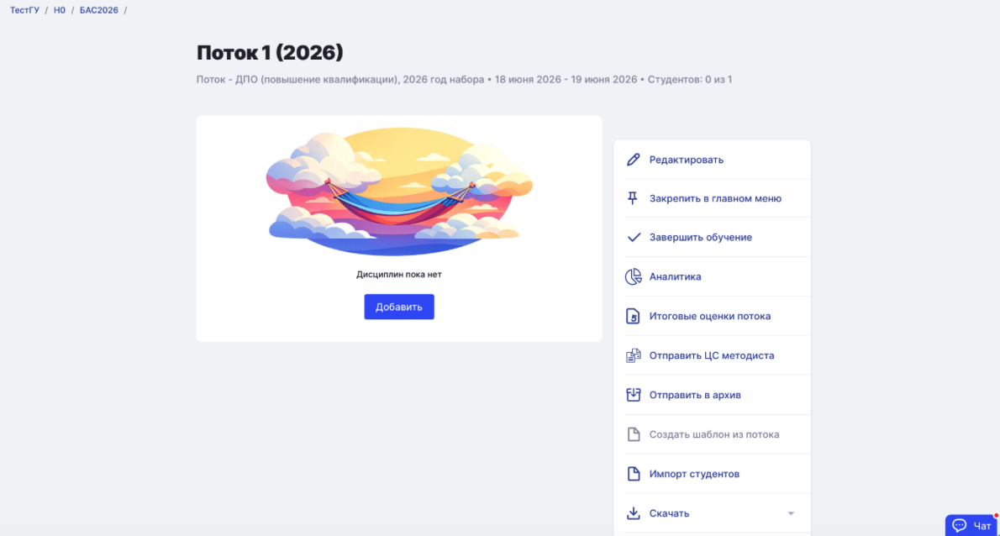{width=1190px height=638px}

Важно: при создании блока обязательно укажите его тип.

После сохранения система перенаправит вас на страницу наполнения блока.

На данном этапе рекомендуется сразу создать структуру программы: добавить модули и темы в соответствии с учебным планом. Активности пока добавлять не требуется.

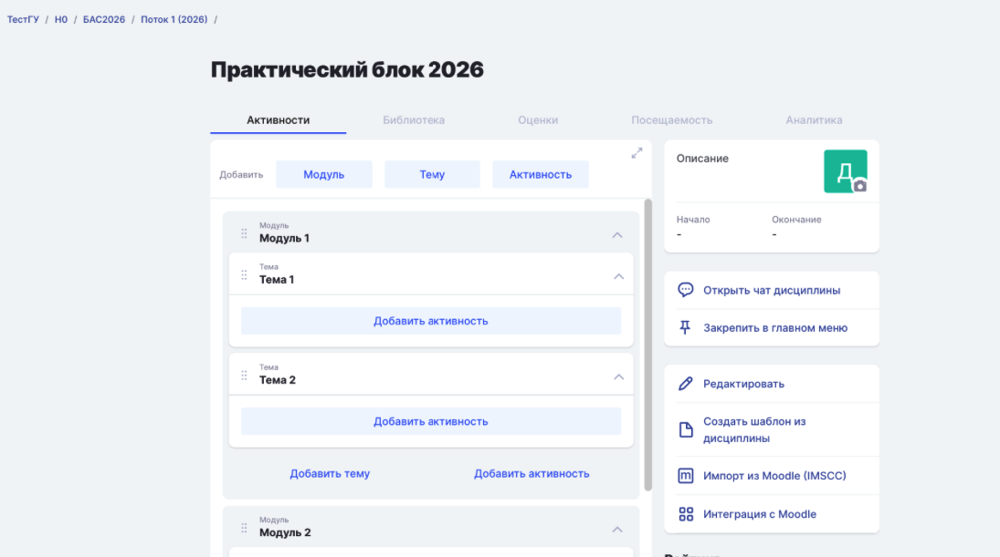{width=1095px height=611px}

Обратите внимание, что для каждого блока и каждой темы необходимо указать уникальный ID, а также описание (иконка файла).

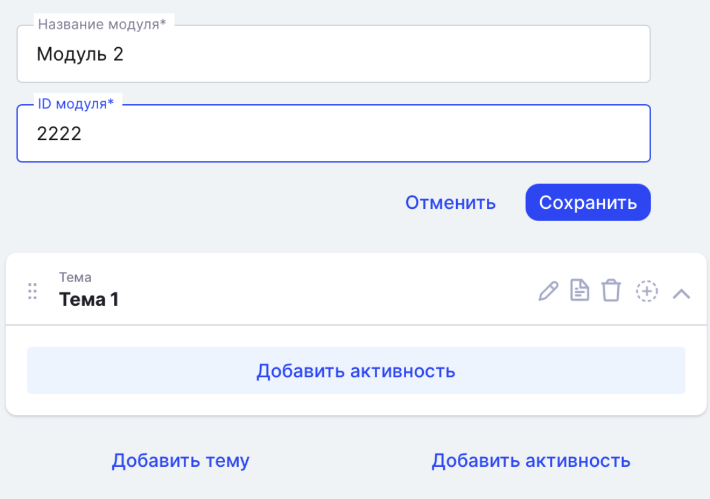{width=1171px height=824px}

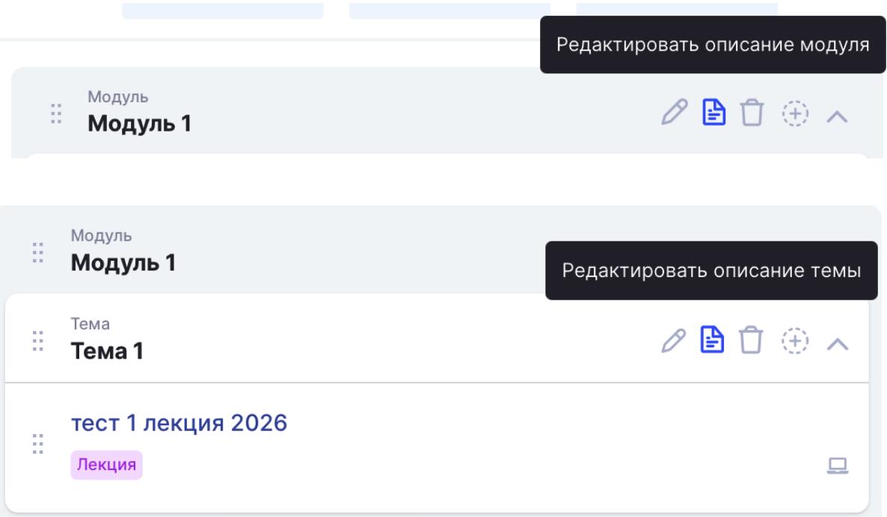{width=1186px height=692px}

После того как структура блока сформирована, создайте шаблон дисциплины. Для этого нажмите **«Создать шаблон из дисциплины»**.

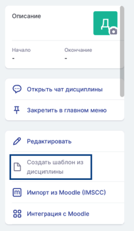{width=264px height=456px}

Это позволит сохранить подготовленную структуру и использовать её при создании других потоков, что значительно ускорит дальнейшую работу.

После создания шаблона вы можете:

-  перейти к созданию следующего блока и его структуры;

-  либо продолжить наполнение текущего блока.

Но перед этим советуем выполнить 4 шаг

## **Шаг 4. Организуйте шаблоны в библиотеке**

После создания шаблона дисциплины (блока) он автоматически сохраняется в библиотеке вашего подразделения.

Перейдите в раздел **«Библиотека»** и откройте библиотеку подразделения, в котором размещена программа.

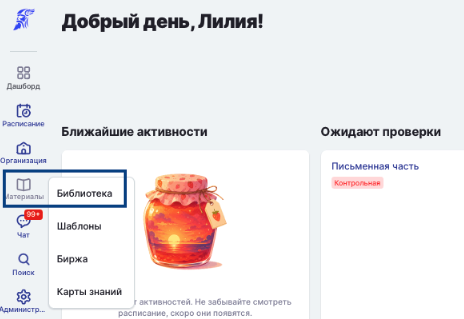{width=464px height=319px}

Создайте новую папку и назовите её так же, как называется ваша программа. Изменение названия папки доступно по клику правой кнопкой мыши по папке, выбрать «Переименовать».

Перенесите в эту папку созданный шаблон дисциплины, сделать это можно по клику правой кнопкой мыши по папке, выбрать «Переместить». По мере создания новых блоков также сохраняйте их как шаблоны и переносите в папку программы.

Для удобства дальнейшей работы рекомендуем сразу создать внутри папки программы структуру каталогов, соответствующую структуре обучения. Например:

-  Модуль 1

   -  Тема 1

   -  Тема 2

-  Модуль 2

   -  Тема 1

   -  Тема 2

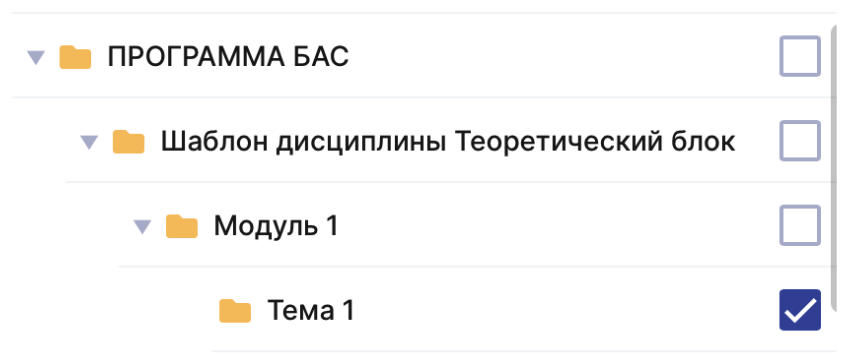{width=853px height=358px}

Такая организация позволит быстро находить нужные шаблоны и в дальнейшем без труда перемещать активности в нужном порядке при наполнении программы и создании новых потоков. Либо выберите наиболее удобный для вас вариант структурирования шаблонов.

В результате в библиотеке будет сформирована единая структура программы со всеми шаблонами дисциплин, модулей, тем и активностей.

## **Шаг 5. Наполните блок активностями**

Вернитесь в программу и откройте необходимый блок.

Добавьте активность в соответствующий раздел структуры. Активность может относиться:

-  к теме;

-  к модулю;

-  ко всему блоку, например если это промежуточная аттестация по итогам блока.

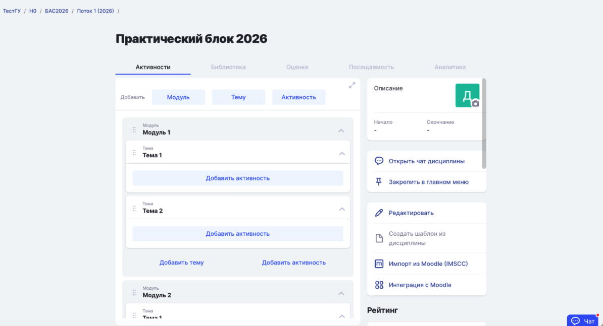{width=1194px height=647px}

При создании активности заполните все необходимые параметры и сохраните изменения.

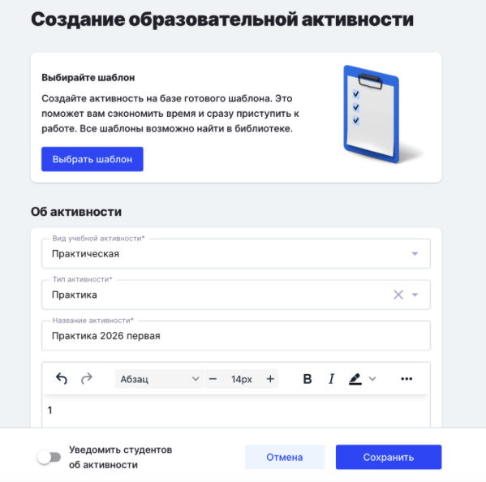{width=599px height=594px}

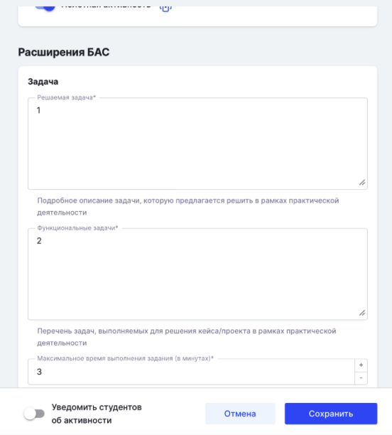{width=552px height=612px}

После сохранения система перенаправит вас на страницу активности.

Если для данной активности не требуется дополнительная настройка, рекомендуем сразу создать из неё шаблон. Для этого воспользуйтесь функцией **«Создать шаблон из активности»**.

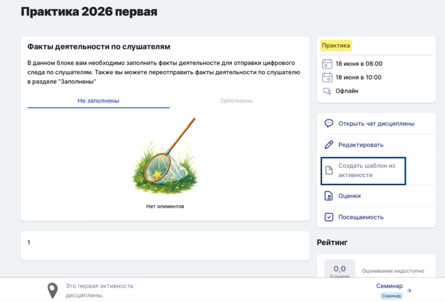{width=887px height=603px}

Созданный шаблон будет автоматически сохранён в библиотеке подразделения.

Перейдите в библиотеку и перенесите шаблон в соответствующую папку программы, модуля или темы в соответствии с подготовленной ранее структурой.

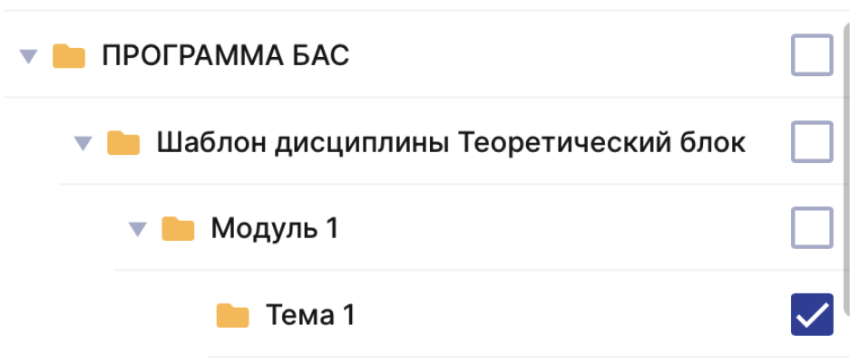{width=947px height=402px}

Создайте остальные активности и наполните другие  блоки.

## **Используйте шаблоны при создании новых потоков**

При таком подходе большая часть параметров программы, блоков и активностей сохраняется в шаблонах. Это позволяет значительно сократить время на создание и наполнение новых потоков.

Однако необходимо учитывать, что часть данных является уникальной для каждого потока. Поэтому после добавления шаблонов потребуется проверить и при необходимости скорректировать отдельные параметры, например:

-  даты проведения обучения;

-  идентификаторы У2035;

-  ссылки на вебинары и занятия;

-  сроки выполнения заданий;

-  другие данные, зависящие от конкретного потока.

После того как программа первого потока полностью заполнена и все необходимые шаблоны созданы, можно переходить к созданию следующего потока.

## **Шаг 6. Наполните новый поток с помощью шаблонов**

Создайте новый поток по инструкции из шага 2. Создавать поток из шаблона не требуется.

После создания потока откройте его и нажмите **«Добавить дисциплину»**.

В открывшемся окне выберите пункт **«Создать из шаблона»** и выберите необходимый шаблон дисциплины.

При создании дисциплины потребуется заполнить:

-  даты проведения обучения;

-  преподавателей.

Остальные параметры будут перенесены из шаблона автоматически.

**Обратите внимание: в текущей версии системы значения ID для тем и модулей не переносятся автоматически, поэтому их необходимо указывать заново для каждого потока.**

После создания дисциплины в ней уже будет отражена подготовленная структура из модулей и тем. Однако потребуется повторно заполнить их ID.

После заполнения ID можно переходить к добавлению активностей.

В зависимости от того, где должна быть размещена активность (в теме, модуле или дисциплине), нажмите кнопку **«+»** рядом с соответствующим элементом структуры и выберите **«Добавить из шаблона»**.

В библиотеке найдите нужную папку программы, затем выберите соответствующий шаблон активности.

После добавления активности проверьте заполненные данные. Большинство параметров будет перенесено из шаблона автоматически, однако некоторые значения потребуется обновить для конкретного потока:

-  дату и время проведения активности;

-  ссылку на вебинар или онлайн-занятие, если для каждого потока используется отдельная ссылка;

-  преподавателя, если он назначается непосредственно на активность;

Повторите эти действия для всех необходимых активностей. Благодаря использованию шаблонов основная часть данных уже будет заполнена, что позволит значительно сократить время на создание нового потока.