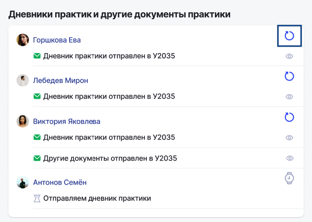

Если есть какие-то проблемы с дневниками, которые уже были отправлены и их нужно заменить, то это можно сделать.

Когда дневник практики загружен, появляется значок корзины, по которому можно этот дневник удалить.

{width=663px height=348px}

После нажатия кнопки «Отправить» и проверки ЦС появится кнопка «Стрелочка», которая позволяет осуществить процесс переотправки ЦС граждан. 

{width=633px height=452px}

После нажатия на «Стрелочку» удаляются ранее загруженные документы по слушателю и появляется возможность заново загрузить дневник или другие документы.

