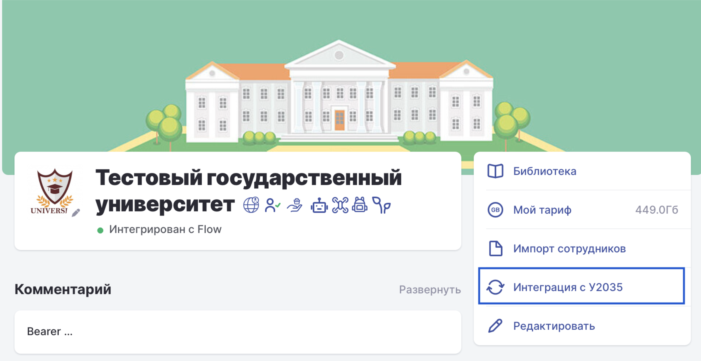
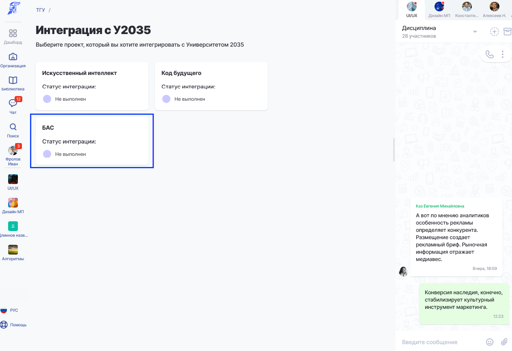

Настроенная интеграция с Университетом 2035 обеспечивает:

-  передачу **Цифрового следа методиста (ЦСМ)** в формате **xAPI** в **LRS Университета 2035**;

-  передачу файлов в хранилище **S3** (видеоматериалов, решений заданий, подтверждающих документов и других файлов, предусмотренных проектом).

**Важно!** Без настроенной интеграции данные цифрового следа и связанные с ним файлы не будут переданы в Университет 2035. В результате цифровой след не будет принят, что может повлиять на учет результатов обучения.

### **Как проверить и настроить интеграцию с Университетом 2035**

1. Перейдите на страницу организации в Odin.

2. В правом боковом меню нажмите **«Интеграции с У2035»**.

3. Проверьте статус интеграции:

   -  **Активен** -- интеграция настроена, дополнительных действий не требуется.

   -  **Не выполнен** -- интеграция не настроена. Выполните настройку, следуя инструкции на странице, затем сохраните изменения. После успешной настройки статус изменится на **«Активен»**.

**Важно!** Если вы начинаете участие в новом году отбора проекта, перед началом работы ознакомьтесь с сообщениями в общем чате проекта. В отдельных случаях может потребоваться сбросить существующую интеграцию и выполнить ее настройку заново.

{width=2386px height=1232px}

## Инструкция по интеграции с хранилищами У2035 (БАС)

Для каждой организации интеграция настраивается отдельно.

## **Шаг 1. Перейдите к настройке интеграции**

1. Откройте страницу **Организации**.

2. Если у вас тариф **«Индивидуальный»** или **«Профессиональный»**, убедитесь, что установлен флаг **«Участник проекта Кадры для БАС»**.

{width=1262px height=866px}

В разделе **«Интеграции с У2035»** выберите карточку проекта.

Настройка интеграции состоит из **4 последовательных этапов**.

.png>)

Настройка интеграции состоит из 4 этапов, на каждом из них надо совершить какое-либо действие.

#### **Этап 1**

На данном этапе необходимо получить данные для подключения **к тестовому контуру** Университета 2035.

1. Нажмите **«Скопировать шаблон»**.

2. Отправьте сформированный шаблон в Университет 2035 для получения тестовых данных.

3. После получения данных нажмите **«Данные у меня»**.

#### Этап 2

На данном этапе необходимо ввести данные, полученные от Университета 2035 для тестового контура, и проверить подключение.

1. Введите полученный параметр **Basic**.

2. Нажмите кнопку **«Подключение»**.

**Важно!** В поле необходимо вводить только значение токена, без добавления префикса **«Basic»**.

Система автоматически проверит подключение к тестовому контуру Университета 2035.

Если подключение выполнено успешно, отобразится соответствующий статус и станет доступна кнопка **«Проверено»**. Нажмите ее, чтобы перейти к следующему этапу настройки интеграции.

Если при проверке возникнет ошибка, проверьте корректность введенного значения **Basic** и повторите попытку.

.png>)

#### Этап 3

После проверки тестового подключения необходимо получить доступ к промышленному контуру Университета 2035.

1. Нажмите **«Скопировать шаблон»**.

2. Отправьте сформированный шаблон в Университет 2035.

В течение **трех рабочих дней** Университет 2035 направит два письма:

-  данные для подключения к промышленному контуру (**Basic**, **Key**, **Secret**);

-  данные для подключения к хранилищу **S3** (**User ID**, **Password**, **Access Key ID**, **Secret Key**, а также URL хранилища).

После получения писем нажмите **«Данные у меня»**.

#### Этап 4

Подключение к промышленному контуру.

1. Введите полученные данные:

-  **Basic**;

-  **User ID**;

-  **URL хранилища S3**;

-  **Access Key ID**;

-  **Secret Key**.

Нажмите **«Интеграция»**.

Система проверит корректность подключения.

Если проверка выполнена успешно:

1. Нажмите **«Все отлично»**.

2. Интеграция будет завершена, а ее статус изменится на **«Активен»**.

Если проверка завершилась с ошибкой, проверьте правильность введенных данных и повторите попытку.

## **Повторная настройка интеграции**

После успешного завершения настройки изменить параметры интеграции нельзя.

Если требуется выполнить настройку заново:

1. Откройте меню **⚙ (шестеренка)** рядом с интеграцией.

2. Выберите **«Отключить»**.

3. Подтвердите отключение.

После этого настройки будут сброшены, статус изменится на **«Не выполнен»**, и интеграцию можно будет настроить повторно.

**Примечание.** Если настройка интеграции еще не завершена, система автоматически сохраняет прогресс. При повторном открытии страницы вы продолжите настройку с того этапа, на котором остановились.

\___________________________________________________________________________________________\_

В зависимости от этапов интеграции, на которых остановился пользователь, статусы в карточке проекта могут меняться:

.png>)

-  Не выполнен - если пользователь не заходил в карточку интеграции

-  В процессе - если пользователь находится на каком-либо этапов интеграции (1/4, 2/4 и т.д.)

-  Ошибка данных - если после ввода Basic на этапах 2 или 4 проверка завершилась не успешно

-  Активен - если все 4 этапа были пройдены успешно.