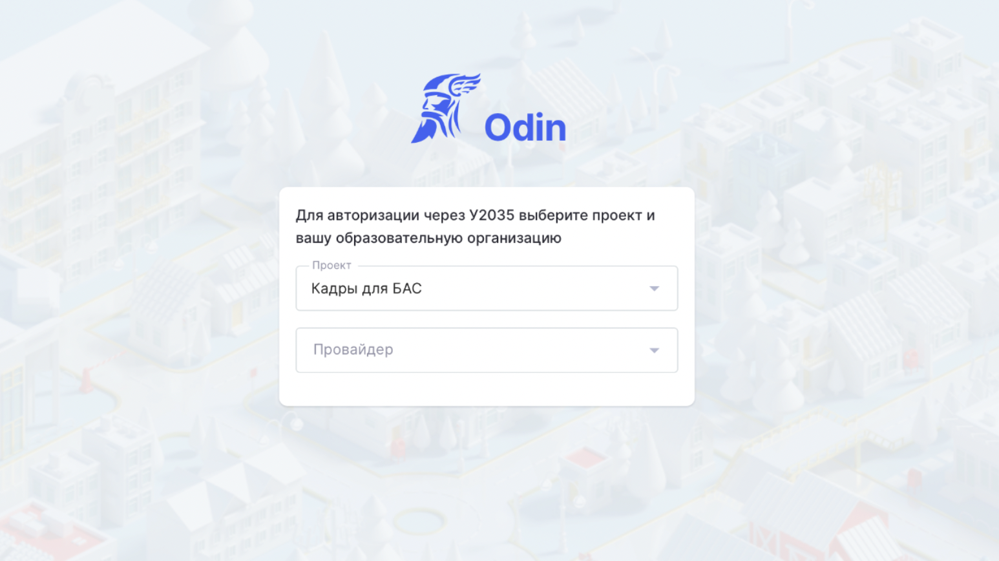

SSO (Single Sign-On) -- это технология единого входа, которая позволяет пользователям авторизовываться в разных системах с использованием одной учетной записи.

{width=1546px height=868px}

**Для настройки интеграции**

1. Запросите доступ к API SSO у Университета 2035 в соответствии [с инструкцией](https://help.2035.university/article/66832) (раздел «Запрос доступов к API SSO»). *Можно сразу запрашивать доступ к промышленному контуру, так как интеграция по SSO уже протестирована на обновленных данных.*

2. В письме используйте данные url, redirect_uri, client_id из системы Odin, указанные в таблице. Ссылка на таблицу размещена в общем чате проекта БАС в MAX.

3. После получения данных от У2035 направьте их в личные сообщения представителю Odin, который взаимодействует с вами в общем чате проекта БАС в MAX, с указанием провайдера, которого вы представляете.

4. Всю дальнейшую работу по интеграции выполнит наша команда.