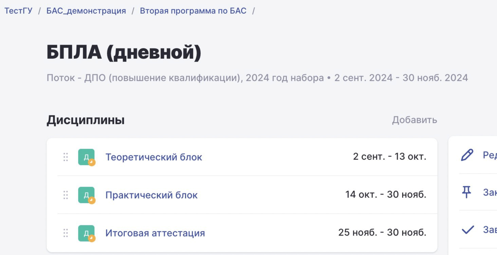

Согласно требованиям Университета 2035, программа проекта БАС должна содержать **теоретический** и **практический** блоки.

В Odin отдельного понятия **«блок»** нет. В качестве блока используется **дисциплина**. 

-  блок **«Теоретический»** = дисциплина с типом блока **«Теоретический»**;

-  блок **«Практический»** = дисциплина с типом блока **«Практический»**;

-  блок **«Другое»** = дисциплина с типом блока **«Другое»**.

**Как создать блок**

На странице потока:

{width=2930px height=1504px}

1. Нажмите кнопку **«Добавить»**.

2. Заполните обязательные поля.

3. В поле **«Тип блока»** выберите одно из значений:

   -  **Теоретический**;

   -  **Практический**;

   -  **Другое**.

4. При необходимости укажите даты проведения дисциплины. Этот параметр необязателен, но позволяет ограничить доступ слушателей к материалам до начала или после окончания обучения.

5. Назначьте преподавателя. В каждой дисциплине должен быть назначен хотя бы один преподаватель с **UNTI ID**, так как сведения о преподавателе передаются в составе Цифрового следа методиста.

6. Нажмите **«Сохранить»**.

**Важно!** В программе может быть только **одна** дисциплина с типом **«Теоретический»** и только **одна** дисциплина с типом **«Практический»**. При попытке создать вторую дисциплину такого же типа Odin выдаст ошибку.

**Блок «Другое»**

Дисциплина с типом **«Другое»** используется для проведения итоговой аттестации.

Для корректной передачи цифрового следа необходимо:

-  добавить в дисциплину активность типа **«Задание»** или **«Контрольная»**;

-  отметить эту активность как **итоговую аттестацию**.

При необходимости в дисциплину можно добавить и другие активности, однако цифровой след итоговой аттестации будет передаваться только по активности, которая используется в качестве итоговой аттестации.

## FAQ

:::tip 

Q: Сколько блоков должно быть всего?

A: Минимум три: по одному для каждого типа -- теоретический, практический и "другое".

Q: Можно ли добавлять другие активности в блок "Другое"?

A: Да, можно добавлять любые активности. Однако цифровой след передается только по активности с типом "Контрольная" или "Задание", которая включена в ЦС методиста для промежуточной и итоговой аттестации.

Q: Нужно ли как-то специально называть блоки?

A: У2035 не предъявляет особых требований к названиям блоков. Однако мы рекомендуем называть их так, чтобы было ясно, что один блок относится к теории, другой к практике, а третий -- к итоговой аттестации.

:::