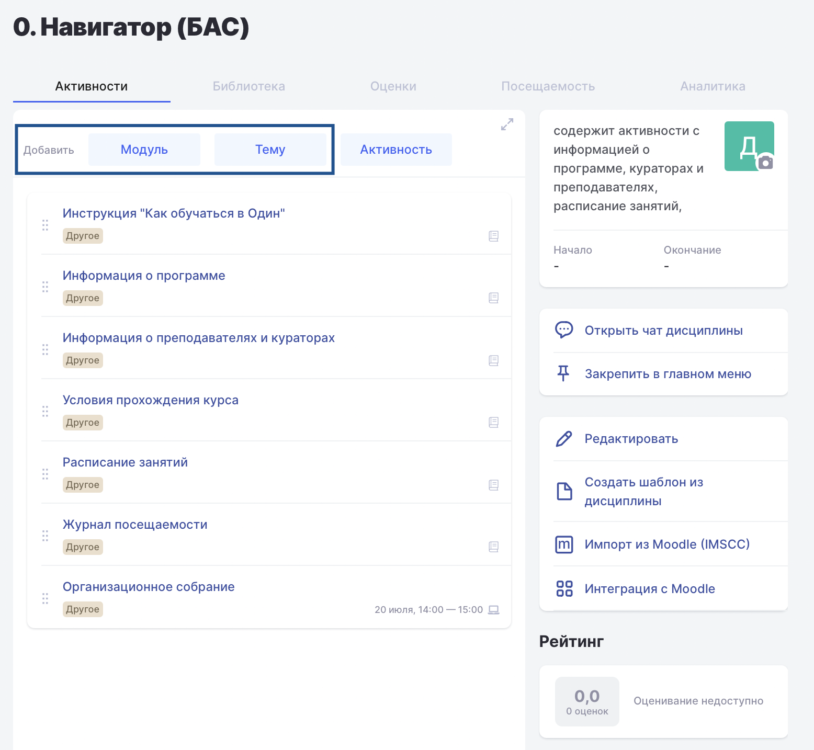

В рамках проекта БАС **модули** и **темы** являются обязательными структурными элементами программы. При этом темы должны размещаться внутри соответствующих модулей.

Создать модули и темы в Odin можно следующим образом:

1\.На странице блока (дисциплины) добавьте модуль.

{width=1556px height=1434px}

2\.Укажите **название модуля**, **идентификатор** и **описание**.

3\.Внутри модуля добавьте темы. Для каждой темы укажите **название**, **идентификатор** и **описание**.

4\.Повторите действия для остальных модулей и тем программы.

5\.При необходимости измените порядок модулей и тем с помощью функции перетаскивания.

**Совет.** Чтобы изменить порядок модулей или тем, нажмите и удерживайте область со значком **шести точек** рядом с названием элемента, затем перетащите его в нужное место и отпустите кнопку мыши.

### **Как добавить описание**

Чтобы добавить или изменить описание модуля или темы, нажмите на значок **документа** рядом с их названием.

После нажатия откроется поле для ввода описания. Введите необходимый текст и сохраните изменения.

Если для модуля или темы описание уже заполнено, значок документа будет подсвечен **зеленым цветом**.

**Важно!** Описание каждого модуля и темы является обязательным полем при формировании Цифрового следа методиста и передается в составе отчета в Университет 2035. 