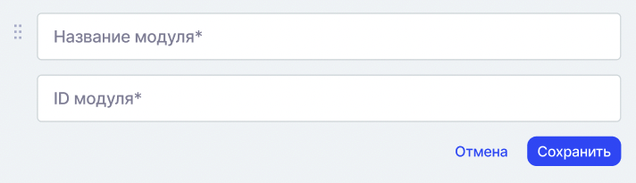
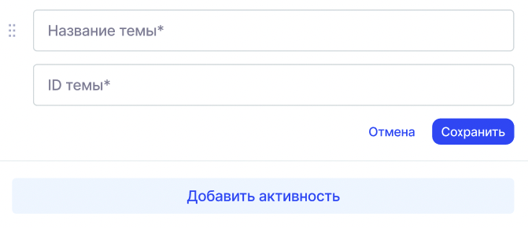

*Идентификаторы используются при создании **программы** в Odin и необходимы для корректного сопоставления данных с информацией в Университете 2035.*

При создании программы для проекта БАС необходимо указать идентификатор программы и потока, а также идентификаторы модулей и тем. Данные идентификаторы используются при формировании и передаче цифрового следа.

## Идентификатор программы

Перейдите в личный кабинет У2035 [по ссылке](https://leader-id.ru/simple/login?client_id=unti2035-sso&redirect_uri=https://sso.2035.university/complete/leader_id/&state=ICOPfEBIFC7SCLkNhtKzgTuGiIF4VzoL&response_type=code&simple_full=true&isLeaderPartnerApp=true).

Найдите курс, который необходимо указать в Odin при [создании программы](./sozdanie-programmy) для проекта БАС, и откройте его.

.png>)

Скопируйте идентификатор: только цифры из адресной строки без слешей (в примере идентификатор - 27217).

.png>)

Вставьте идентификатор в Odin и сохраните.

.png>)

## Идентификаторы модуля, темы

Данные идентификаторы обязательны к указанию в Odin, информацию о них надо также запрашивать в У2035.

{width=712px height=205px}

{width=671px height=290px}