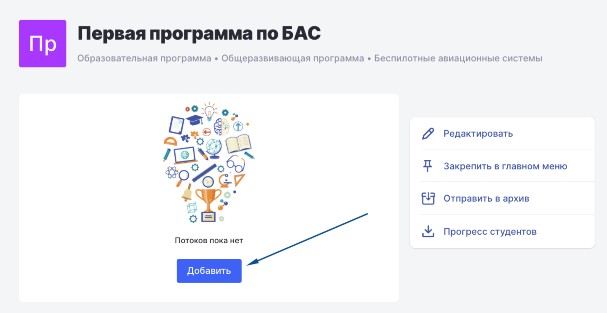
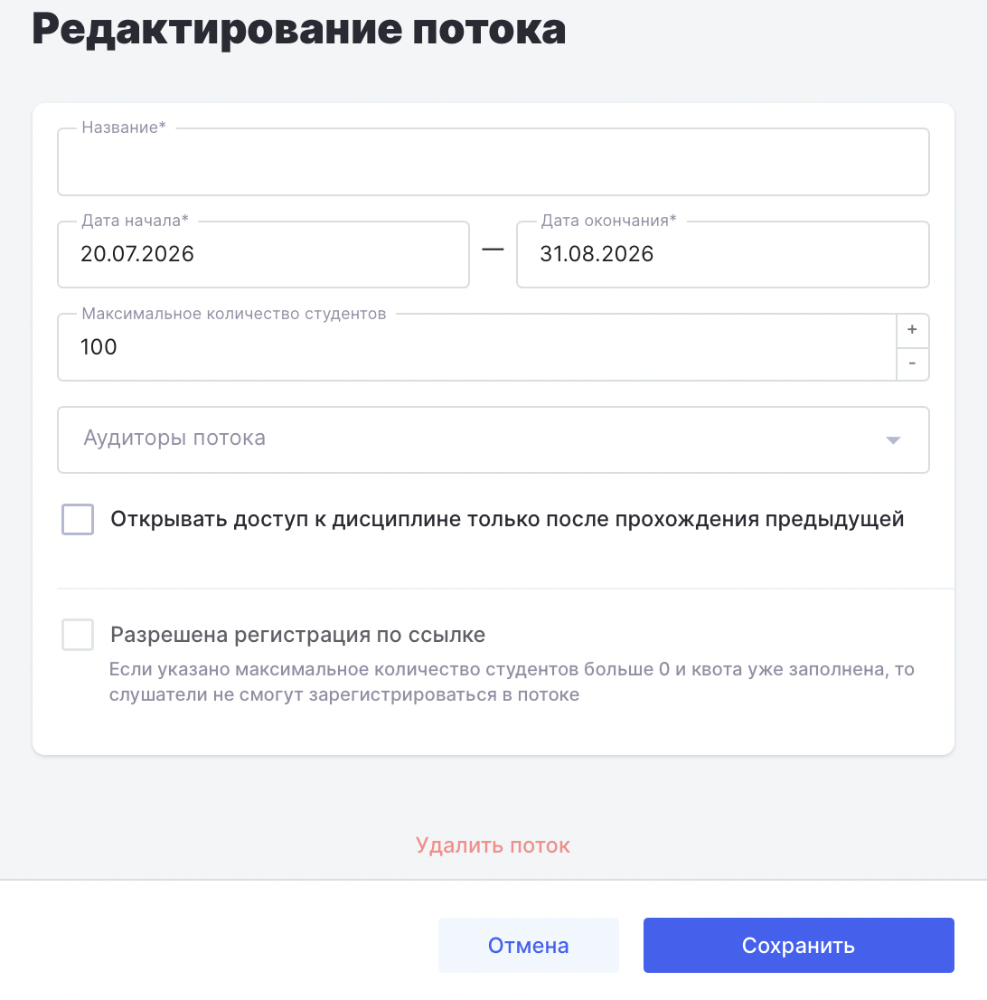

После создания программы необходимо добавить в неё потоки. В Odin и У2035 понятие "поток" идентично -- это группа студентов, объединённых в один набор.

После создания программы вы попадёте на её страницу, где сможете создать поток следующим образом:

Для начала нажмите кнопку "Добавить"

{width=2452px height=1264px}

Далее заполните все обязательные поля и сохраните поток.

{width=1092px height=1106px}

**Важно!** Если для вашей программы требуется передача в Университет 2035 подтверждающих документов по итоговой аттестации (например, протокола защиты, рецензии на итоговую работу, видеозаписи защиты и других документов), при создании потока необходимо включить настройку **«Требуются подтверждающие документы по итоговой аттестации»**.

Подробная инструкция по работе с подтверждающими документами доступна в статье [**«Загрузка документов по итоговой аттестации»**](./../otpravka-cs-grazhdanina-v-u2035/itogovaya-attestaciya).