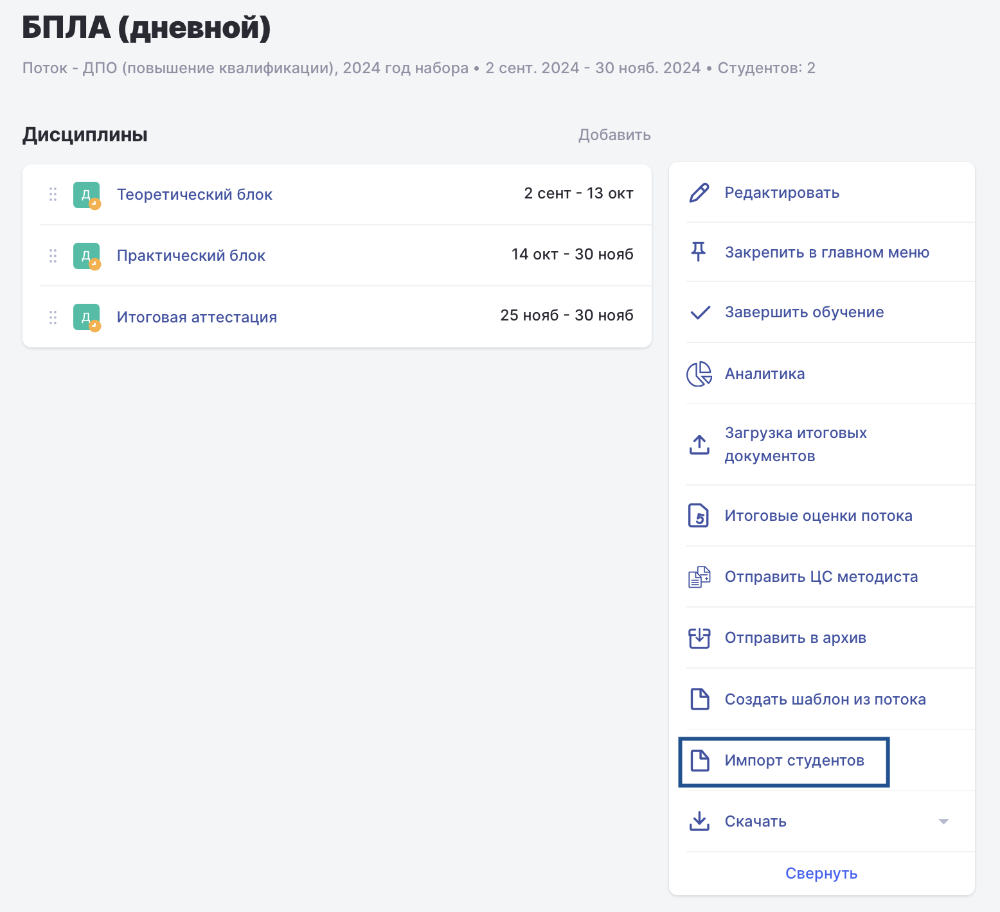
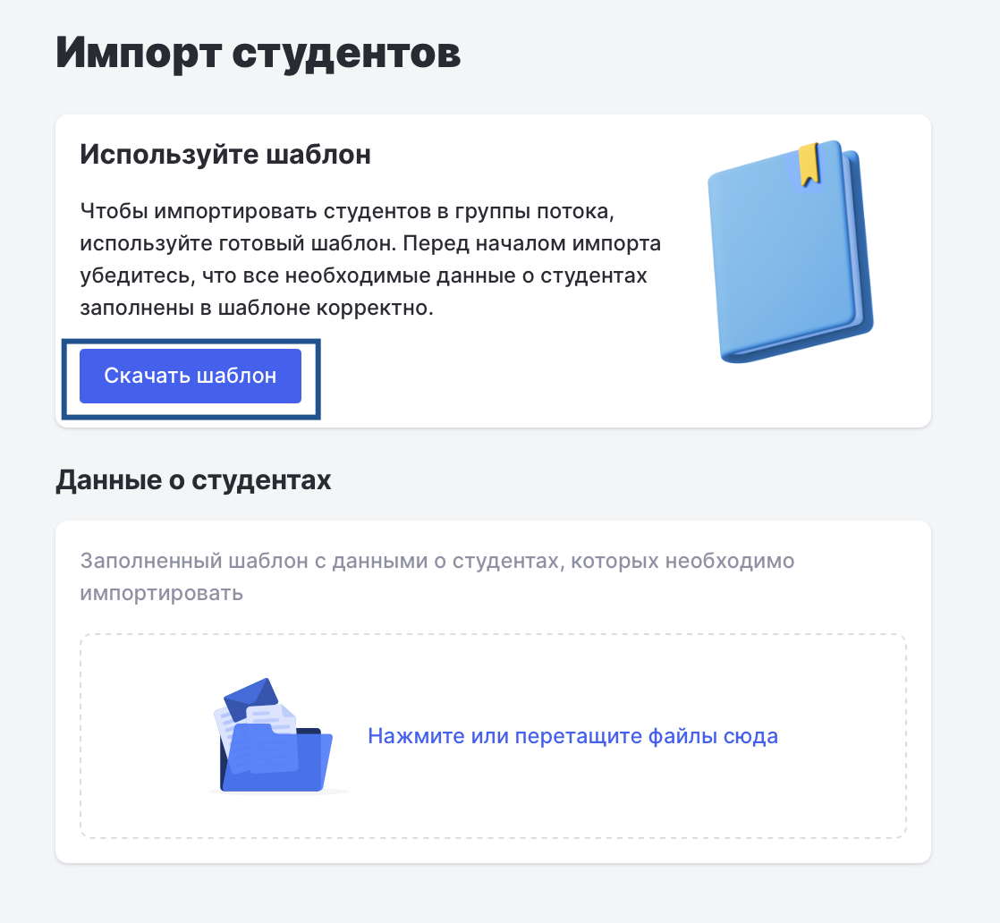
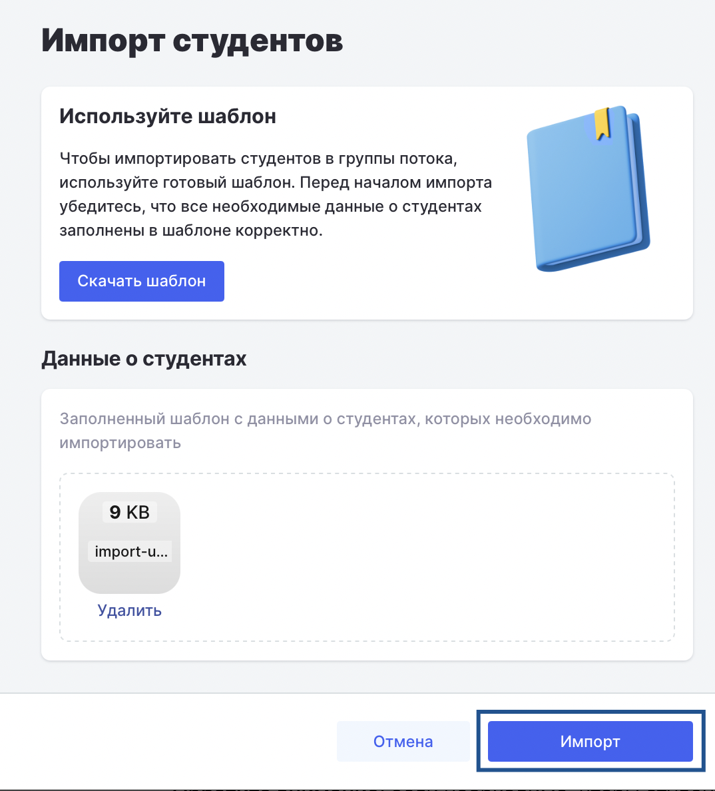

После того как слушатели успешно прошли вводный курс и тестирование на платформе У2035 и были зачислены на программу, необходимо начать их обучение в Odin.

Для предоставления слушателям доступа к платформе выполните следующие действия:

1\.Перейдите на страницу потока.

2\.Нажмите кнопку **«Импорт студентов»**.

{width=1556px height=1420px}

3\.Скачайте шаблон и заполните его необходимыми данными.

{width=1118px height=1032px}

4\.Загрузите заполненный файл на этой же странице.

5\.Нажмите кнопку **«Импорт»**.

{width=1074px height=1188px}

После успешного импорта студенты получат на указанные email-адреса приветственное письмо с кнопкой для входа в Odin. Авторизоваться на платформе они смогут с помощью своей учетной записи У2035, перейдя по ссылке из письма. Также доступен альтернативный способ входа -- через страницу авторизации в Odin с выбором способа входа через У2035.

Импортированные студенты будут автоматически прикреплены к потоку, в который были добавлены, и получат доступ к содержимому курса.

**Обратите внимание:** если необходимо, чтобы студенты не получили доступ к учебным материалам заранее, настройте соответствующие параметры доступа на странице дисциплины.

## Вход студентов в Odin

Есть [шаблон инструкции по входу в систему](https://docs.google.com/document/d/1hhUbJ0v8dPbuvWD_8MNG1oiewUxHxsbvmgRWcrd2qgo/edit?tab=t.0), который можно адаптировать под конкретную организацию и отправлять своим студентам.