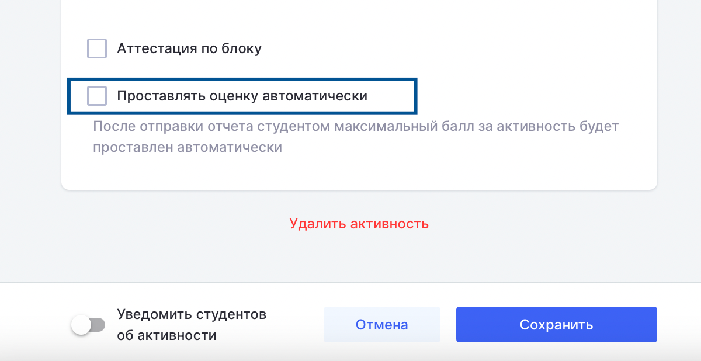

Чтобы активировать данный функционал, на странице редактирования активности необходимо установить чекбокс **«Проставлять оценку автоматически»**.

{width=1200px height=618px}

\*Максимальный балл за активность -- это балл, который указан в поле максимального балла на странице редактирования активности.

При активации данного функционала процесс работы будет следующим:

**1\. Активности с типом «Практика», «Самостоятельная работа», «Лабораторная», «Семинар».**

Дата начала активности наступает (если она задана) -> открывается возможность заполнить отчет -> ответственный со стороны провайдера (например, преподаватель или методист) заполняет отчет по результатам выполнения активности -> слушателю автоматически выставляется максимальный балл за активность\* -> автоматически отправляется ЦС по данной активности.

**2\. Активность с типом «Задание».**

Слушатель загружает решение -> открывается возможность заполнения отчета -> ответственный со стороны провайдера заполняет отчет -> слушателю автоматически выставляется максимальный балл за активность\* -> автоматически отправляется ЦС по данной активности.

**3\. Активность с типом «Контрольная».**

Функционал не применяется, так как полученный слушателем балл за тест может отличаться от максимального балла, указанного для активности.