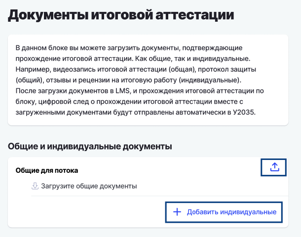
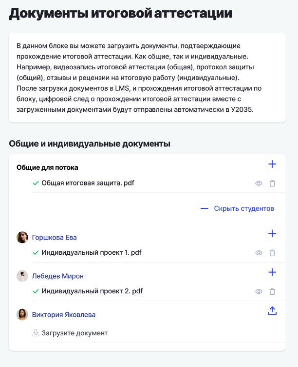
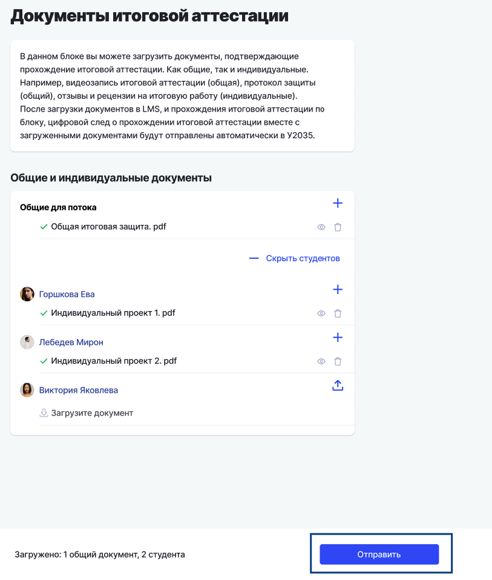
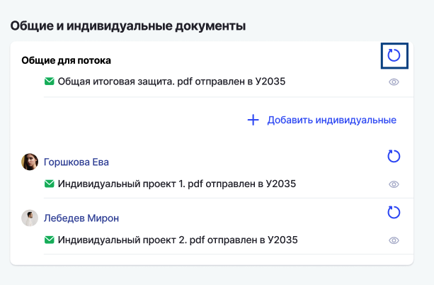
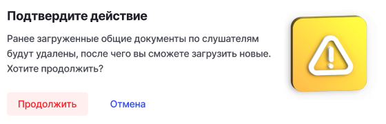

Если в программе предусмотрена подгрузка дополнительных документов, подтверждающих проведение итоговой аттестации (например, протокол защиты или рецензия на итоговую работу), то теперь их можно добавить следующим образом:

1\. До проведения аттестации на странице редактирования блока (дисциплины) по итоговой аттестации проставьте галку у чекбокса "Требуются подтверждающие документы по итоговой аттестации".

.png>)

2\.На самой странице блока итоговой аттестации появится кнопка "Загрузить документы". Нажмите на нее, чтобы подгрузить необходимые документы после проведения итоговой аттестации.

.png>)

3\.После того, как вы загрузите необходимые документы на этой странице, в У2035 вместе с ними будет отправлен ЦС гражданина прохождение итоговой аттестации по программе.

## Документы итоговой аттестации

В программах БАС на странице "Документы итоговой аттестации" размещен блок "Общие и индивидуальные документы", в котором доступна загрузка документов.

{width=610px height=480px}

Для загрузки общих документов надо нажать на символ "Загрузить».  Откроется дропзона для добавления файлов с устройства или из активности "Итоговая аттестация" (она всегда одна, запись тоже одна). Можно добавить неограниченное число файлов. После успешной загрузки следует нажать "Готово".\
В блоке "Общие и индивидуальные документы" загруженный документ отобразится с ✓.\
У каждого документа доступны действия: просмотр и удаление.\
Можно дополнительно загрузить другие документы через кнопку +.\
Внизу страницы кнопка "Отправить" становится кликабельной, при клике на которую происходит отправка ЦС, подробнее будет описано ниже.\
Общие документы относятся ко всем студентам потока.\
Пользователь также может добавить индивидуальные документы. Для этого нажать на поле "+ Добавить индивидуальные». Откроется весь список студентов потока. Кнопка "+ Добавить индивидуальные" меняет состояние на "Скрыть студентов", при повторном нажатии список скрывается.

{width=612px height=752px}

При нажатии на символ "Загрузить" открывается дропзона. Можно добавить неограниченное количество файлов.

Аналогично общим документам, для индивидуальных доступно удаление, просмотр и добавление.\
Можно загрузить документы в разных вариациях: только общие, только индивидуальные или все вместе. Индивидуальные документы можно добавлять как для всех студентов, так и выборочно.\
Внизу страницы отображается информация какие документы и в каком количестве загружены, в формате "Загружено: n общий документ, n студента".

Когда все документы загружены, можно нажимать на кнопку "Отправить".

{width=813px height=957px}

После нажатия кнопки "Отправить" начинается временной лаг:\
\- в этот период документы (цифровой след) передаются в У2035.\
\- кнопка  "Отправить" блокируется.\
\- загрузка, просмотр и редактирование документов становятся недоступны.\
\- при наведении на иконку с часами отображается тултип "Документы отправляются автоматически".\
Если были добавлены индивидуальные документы:

\- отображаются только те студенты, по которым были загружены файлы.

После успешной отправки цифрового следа у приложенных документов отображаются только индикаторы успешной отправки (✓ ) и просмотра. Кнопка "Отправить" заблокирована.

Для индивидуальных документов отображаются только студенты с отправленными файлами.

Возможна переотправка ЦС при нажатии на символ (↺):

{width=613px height=402px}

При нажатии на кнопку появляется уведомление о подтверждении действий "Ранее загруженные общие документы по слушателям будут удалены, после чего вы сможете загрузить новые. Хотите продолжить?"

{width=560px height=180px}

Также можно удалить документы по конкретному студенту. 

\- После подтверждения загруженные документы удалятся.

\- Затем можно загрузить новые и повторно отправить ЦС.

Также можно добавлять другие индивидуальные документы:

\- при нажатии "Добавить" отображается весь список студентов\
\- те, по кому уже была отправка, отображаются вверху списка, остальные -- ниже списком