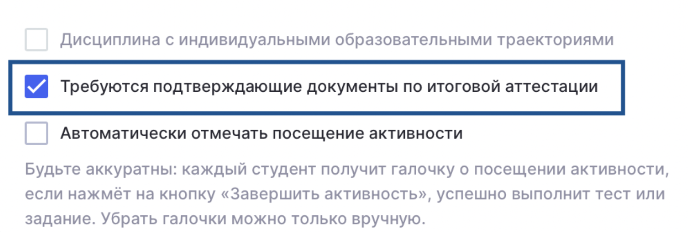
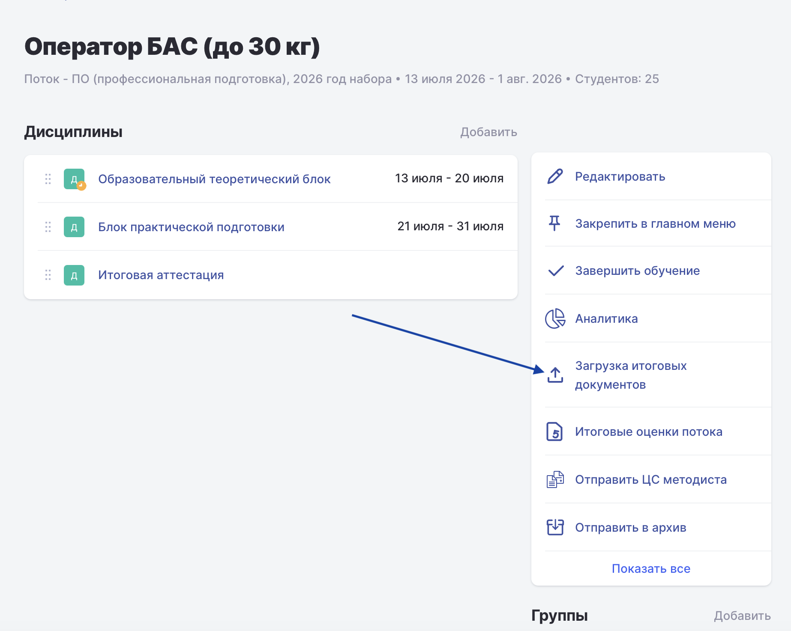
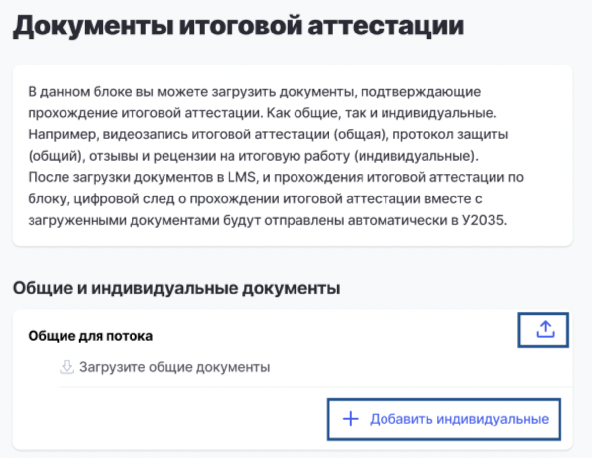
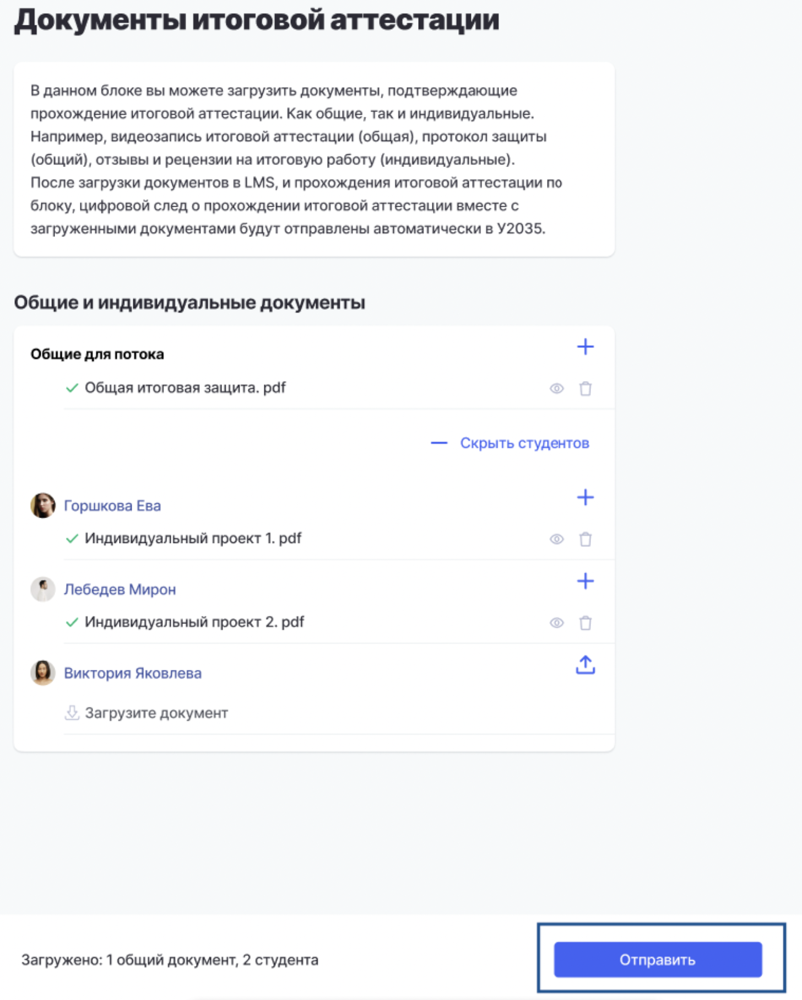
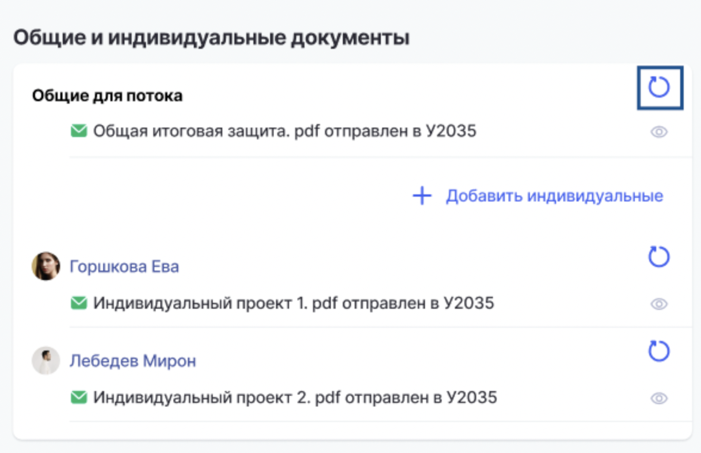

Если по программе предусмотрена передача в Университет 2035 документов, подтверждающих проведение итоговой аттестации (например, протокола защиты, рецензии на итоговую работу, видеозаписи защиты и др.), необходимо загрузить их через страницу **«Документы по итоговой аттестации»**. 

## **1\. Проверка и включение настройки**

До проведения итоговой аттестации откройте страницу редактирования потока и установите флажок **«Требуются подтверждающие документы по итоговой аттестации»**.

{width=1552px height=526px}

После включения настройки на странице потока станет доступна кнопка **«Загрузка итоговых документов»**.

{width=1846px height=1474px}

## **2\. Загрузка документов**

На странице **«Документы по итоговой аттестации»** доступен блок **«Общие и индивидуальные документы»**.

Можно загрузить:

-  **общие документы** -- документы, которые относятся ко всем слушателям потока;

-  **индивидуальные документы** -- документы, которые относятся к конкретным слушателям.

Доступны следующие варианты загрузки:

-  только общие документы;

-  только индивидуальные документы;

-  общие и индивидуальные документы одновременно.

Для загрузки документа нажмите кнопку **«Загрузить»**. Откроется окно добавления файлов, в котором можно выбрать документы с устройства или из активности **«Итоговая аттестация»**.

Количество загружаемых файлов не ограничено. После успешной загрузки нажмите кнопку **«Готово»**.

Чтобы загрузить индивидуальные документы, нажмите кнопку **«+ Добавить индивидуальные»**. Откроется список слушателей потока, для которых можно добавить документы.

{width=1202px height=930px}

Для каждого документа доступны действия:

-  просмотр;

-  удаление;

-  добавление дополнительных файлов.

## **3\. Отправка цифрового следа**

После загрузки необходимых документов кнопка **«Отправить»** становится активной.

{width=1456px height=1814px}

После нажатия кнопки:

-  документы и цифровой след прохождения итоговой аттестации автоматически начинают передаваться в Университет 2035;

-  кнопка **«Отправить»** блокируется;

-  загрузка, просмотр, изменение и удаление документов становятся недоступны до завершения отправки.

После успешной отправки у документов отображаются отметки успешной передачи.

Для индивидуальных документов отображаются только те слушатели, по которым были отправлены файлы.

## **4\. Повторная отправка цифрового следа**

При необходимости можно выполнить повторную отправку цифрового следа с помощью кнопки **↺**.

{width=1176px height=760px}

После подтверждения:

-  ранее загруженные документы будут удалены;

-  можно загрузить новые файлы;

-  выполнить повторную отправку цифрового следа.

Также доступно удаление документов только по отдельному слушателю и загрузка для него актуальных файлов.

**Обратите внимание:** подтверждающие документы по итоговой аттестации загружаются только в тех программах, где такая передача предусмотрена.