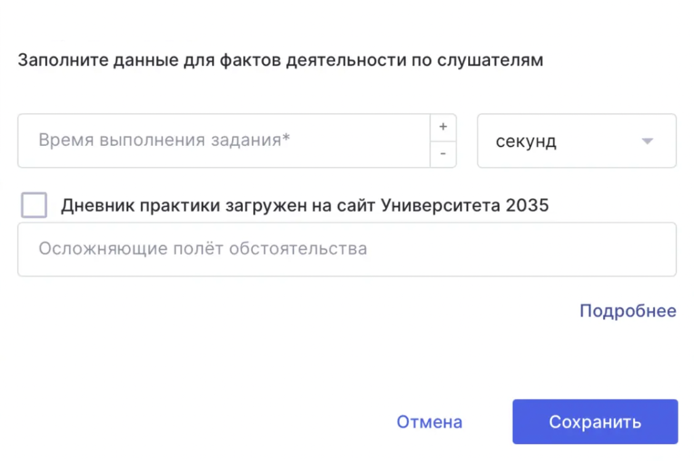

Цифровые следы гражданина (ЦСГ) формируются и **отправляются автоматически** при изменении статуса образовательной активности. В зависимости от типа активности и ее настроек отправка может происходить после завершения активности слушателем, выставления оценки преподавателем или выполнения дополнительных условий.

Ниже приведены условия отправки каждого типа ЦСГ.



---

*  

   **Тип ЦС**

*  

   **Условие отправки**

*  

   **Комментарий**

---

*  

   ЦС гражданина просмотр видеоконтента

*  

   **Обычные видео:**

   \- Если видео находится в составе иного структурного элемента программы, то ЦС гражданина отправится, когда слушатель нажмет кнопку "Завершить активность" в данной активности (слушатель не сможет завершить активность, пока у него не просмотрено 80% от видеоматериала, находящегося в составе данной активности)

   \- Если видео находится в составе теоретической активности, то ЦС гражданина отправится, когда вы выставите оценку слушателю за данную активность. В ЦС будет указан % просмотра, который был в момент выставления оценки слушателю.

   \- Если видео находится в составе практической активности, то ЦС гражданина отправится, когда вы выставите оценку слушателю за данную активность. В ЦС будет указан % просмотра, который был в момент выставления оценки слушателю.

   **Вебинары (проходят в Odin):**

   \- Если вебинар предполагается в составе иного структурного элемента программы, то ЦС гражданина отправится, когда слушатель нажмет кнопку "Завершить активность" в данной активности. Однако, слушатель не сможет завершить активность, если он присутствовал менее 80% времени вебинара, либо просмотрел менее 80% записи вебинара.

   \- Если вебинар предполагается в составе теоретической активности, то ЦС гражданина отправится, когда вы выставите оценку слушателю за данную активность. В ЦС будет указан % просмотра, который был в момент выставления оценки слушателю.

   \- Если вебинар предполагается в составе практической активности, то ЦС гражданина отправится, когда вы выставите оценку слушателю за данную активность. В ЦС будет указан % просмотра, который был в момент выставления оценки слушателю.

   **Вебинары (проходят не в Odin)**:

   \- Если вебинар предполагается в составе иного структурного элемента программы, то ЦС гражданина отправится, когда слушатель нажмет кнопку "Завершить активность" в данной активности. Если к этому моменту вы проставили слушателю посещаемость, то ЦС гражданина отправится с отметкой 100% присутствия на вебинаре. Если вы не проставили отметку посещаемости, то слушатель не сможет завершить активность пока не просмотрит не менее 80% от записи вебинара, которую вы должны подгрузить в активность.

   \- Если вебинар предполагается в составе теоретической активности, то ЦС гражданина отправится, когда вы выставите оценку слушателю за данную активность. Если к этому моменту вы проставили слушателю посещаемость, то ЦС гражданина отправится с отметкой 100% присутствия на вебинаре. Если вы не проставили отметку посещаемости, то мы возьмем значение % просмотра записи на момент, когда вы проставите оценку.

   \- Если вебинар предполагается в составе практической активности, то ЦС гражданина отправится, когда вы выставите оценку слушателю за данную активность. Если к этому моменту вы проставили слушателю посещаемость, то ЦС гражданина отправится с отметкой 100% присутствия на вебинаре. Если вы не проставили отметку посещаемости, то мы возьмем значение % просмотра записи на момент, когда вы проставите оценку.

*  

   Расшифровка иных структурных элементов/теоретических/практических активностей в таблице -

---

*  

   ЦС гражданина просмотр текстовых элементов презентаций

*  

   \- Отправляется в момент изменения статуса активности (либо слушатель нажал кнопку "Завершить активность", либо вы выставили слушателю оценку за эту активность)

   \- Если слушатель посещал страницу, где расположен текстовый материал, то уйдет информация в ЦС о том, что текстовый материал изучен на 100%

*  

   

---

*  

   ЦС гражданина прохождение теоретических активностей

*  

   \- Отправляется при получении оценки слушателем за данную активность

*  

   Что такое теоретические активности -

---

*  

   ЦС гражданина прохождение промежуточной аттестации в теоретическом блоке

*  

   \- Отправляется при получении оценки слушателем за данную активность

*  

   

---

*  

   ЦС гражданина прохождение практических активностей

*  

   \- Отправляется при получении оценки слушателем за данную активность

*  

   Что такое практические активности -

---

*  

   ЦС_ФД_Гражданина_прохождение_практических_активностей

*  

   \- Отправляется автоматически вместе с ЦС гражданина прохождение практических активностей (1.2.4)

*  

   

---

*  

   ЦС гражданина прохождение промежуточной аттестации в практическом блоке

*  

   \- Отправляется при получении оценки слушателем за данную активность

*  

   

---

*  

   ЦС_ФД\_ Гражданина_прохождение_промежуточной_аттестации_в_практическом_блоке

*  

   \- Отправляется автоматически вместе с ЦС гражданина прохождение промежуточной аттестации в практическом блоке (1.2.5)

*  

   

---

*  

   ЦС гражданина прохождение практического блока

*  

   \- Отправляется при получении оценки слушателем за данную активность

*  

   \- Оценка за прохождение практического блока берется из активности, где вы выставили флаг "Аттестация по блоку"

   \- Аттестация по блоку может быть одновременно и промежуточной аттестацией по модулю в практическом блоке

   \- После того как дневник практики будет загружен на сайт У2035, требуется поставить отметку в активности, ЦСГ переотправятся автоматически (подробнее в статье)

---

*  

   ЦС гражданина прохождение итоговой аттестации по программе

*  

   \- Отправляется при получении оценки слушателем за данную активность

*  

   \- Если ИА у вас проходит в формате активности с типом "Задание", то дополнительно требуется наличие решения задания (прикрепляется слушателем), включающее в себя индивидуальное видео прохождения ИА

   \- Дополнительно требуется прикрепить видео общей защиты на странице "Загрузить документы"

---

*  

   ЦС_ФД_Гражданина_прохождение_итоговой_аттестации

*  

   \- Отправляется вместе с ЦС гражданина прохождение итоговой аттестации по программе (1.3)

*  

   \- Требуется заполнение отчета по слушателю на странице активности, являющейся ИА, для корректной отправки ЦС

---

*  

   ЦС гражданина переписка в LMS

*  

   Мы накапливаем сообщения, отправленные в чат или комнату дисциплины, и передаем их каждые 6 часов.

*  

   



## **Контроль своевременной отправки ЦСГ**

Согласно требованиям Университета 2035, цифровые следы гражданина (ЦСГ) должны быть отправлены **не позднее 48 часов** с момента возникновения события.

Чтобы убедиться, что ЦСГ были успешно отправлены и не содержат ошибок, рекомендуем регулярно проверять внутренний дашборд контроля отправки ЦСГ. Подробнее о работе с дашбордом читайте в статье **«\<ссылка на статью о дашборде>»**.

Доступ к дашборду предоставляется по запросу. Если у вас еще нет доступа, обратитесь в службу поддержки Odin.

\_____________________________________\_

#### Когда меняется статус прохождения активности?

\- Для активности с типом “Контрольная” статус прохождения изменится, когда студент пройдет тест.

\- Для активности с типом “Задание” статус изменится, когда студент отправит решение задания на проверку и получит оценку.

\- Во всех остальных типах активностей (например, “Самостоятельная работа” или “Лекция”), статус прохождения изменится, когда студент нажмет на странице активности кнопку “Завершить активность”.

2\. Информация, которая передается после подтверждения отчета преподавателем ИЛИ по истечении 48 часов с момента отправки отчета студентом (если преподаватель его не подтвердил):

\- ЦС гражданина прохождение практических активностей

\- ЦС гражданина прохождение промежуточной аттестации в практическом блоке

\- ЦС гражданина прохождение итоговой аттестации по программе

3\. Прочие отчеты:

\- ЦС гражданина переписка в LMS

Мы накапливаем сообщения, отправленные в чат или комнату дисциплины, и передаем их каждые 6 часов.

\- ЦС гражданина прохождение практического блока.

**Подробно про ЦС гражданина о прохождении практического блока**

В отличие от отчета "ЦС гражданина прохождение практических активностей" данный отчет описывает прохождение слушателем всего практического блока и включает в себя:

\- Информацию о прохождении испытания по всему практическому блоку (оценка, время прохождение такого испытания)

\- Дневник прохождения блока практической подготовки (если программа дистанционная, то дневник практики не надо загружать)

\- Прочие документы, описывающие факт прохождения слушателем практического блока (в соответствии с договорной документацией)

Чтобы отчет был корректно передан, надо проставить галку в чекбоксе "Аттестация по блоку" для активности, которая является промежуточной аттестацией по всему блоку. Данный чекбокс находится на странице редактирования активности в блоке "Расширения БАС".

.png>)

\- Если у вас одна промежуточная аттестация в блоке, то она будет являться также аттестацией по всему практическому блоку (ставим как галку "Аттестация", так и "Аттестация по блоку" на странице редактирования активности).

\- Если у вас несколько промежуточных аттестаций в блоке, то аттестацией по всему практическому блоку будет последняя аттестация в блоке (ставим дополнительно галку "Аттестация по блоку" только у нее)

Дневники практики **загружаются только на платформу Университета 2035**. Отдельный ЦС по дневникам не отправляется. В ЦСГ **«Прохождение практического блока»** передается только информация о том, загружен дневник практики в Университет 2035 или нет. Для этого в активности с типом контроля **«Аттестация по блоку»** в отчете **«Факты деятельности»** есть чекбокс: **«Дневник практики загружен на сайт Университета 2035»**.

**Как теперь выглядит процесс**

1\. Слушатель загружает работу, по ней выставляется оценка. Формируется и отправляется ЦСГ.

2\. Если на этот момент чекбокс еще не установлен, в ЦСГ будет передано значение **false (дневник не загружен**).

3\. После того как дневник практики будет загружен в Университет 2035: откройте отчет в нужной активности; установите отметку **«Дневник практики загружен на сайт Университета 2035**» и сохраните изменения.

4\. После сохранения система **автоматически повторно отправит ЦС**Г, уже со значением **true (дневник загружен**).

**Важно**: для этого изменения **не требуется отменять и повторно отправлять ЦС**М. Если дневники уже были загружены в Университет 2035, вы можете сейчас открыть соответствующие активности, установить отметки о загрузке и сохранить изменения -- система самостоятельно выполнит повторную отправку ЦСГ.

{width=1318px height=876px}

**Документы итоговой аттестации**

Если в программе предусмотрена подгрузка дополнительных документов, подтверждающих проведение итоговой аттестации (например, протокол защиты или рецензия на итоговую работу), добавить их можно следующим образом:

1. До проведения аттестации на странице редактирования блока (дисциплины) по итоговой аттестации надо проставить галку у чекбокса "Требуются подтверждающие документы по итоговой аттестации".

.png>)

1. На самой странице блока итоговой аттестации появится кнопка "Загрузить документы". Надо нажать на нее, чтобы подгрузить необходимые документы после проведения итоговой аттестации.

.png>)

1. После того, как необходимые документы будут загружены на этой странице, в У2035 вместе с ними будет отправлен ЦС гражданина прохождение итоговой аттестации по программе.

.png>)