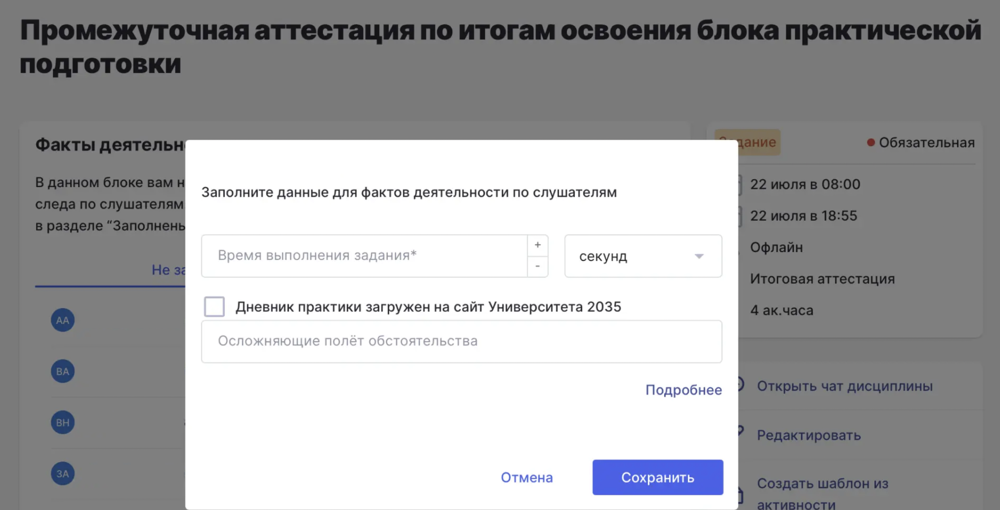

Для программ набора 2026 года дневники практики загружаются на платформу Университета 2035. В Odin необходимо только указать факт загрузки дневника практики, чтобы эта информация была передана в составе цифрового следа гражданина (ЦСГ) «Прохождение практического блока».

Для этого в активности с типом контроля **«Аттестация по блоку»** в отчете **«Факты деятельности»** добавлен чекбокс:

**«Дневник практики загружен на сайт Университета 2035»**.

## **Как работать с отметкой о загрузке дневника практики**

1. Слушатель проходит активность «Аттестация по блоку». Если на момент формирования ЦСГ отметка **«Дневник практики загружен на сайт Университета 2035»** не установлена, в ЦСГ передается значение **false** -- дневник практики не загружен.

2. Ответственное лицо (например, преподаватель, методист или другой сотрудник, назначенный для работы с дневниками практики) загружает дневники практики на сайт Университета 2035. Порядок загрузки дневников практики в Университет 2035 необходимо уточнить в соответствующих инструкциях Университета 2035.

3. После загрузки дневников практики необходимо вернуться в Odin и установить отметку о загрузке. Для этого:

   -  откройте отчет **«Факты деятельности»** в соответствующей активности;

   -  установите чекбокс **«Дневник практики загружен на сайт Университета 2035»**;

   -  сохраните изменения.

4. После сохранения изменений система автоматически повторно отправит ЦСГ.\*\*В обновленном ЦСГ будет передано значение **true** -- дневник практики загружен на сайт Университета 2035.

{width=2386px height=1218px}